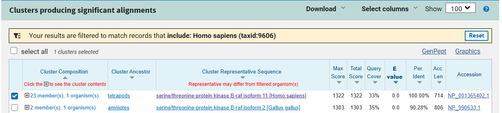
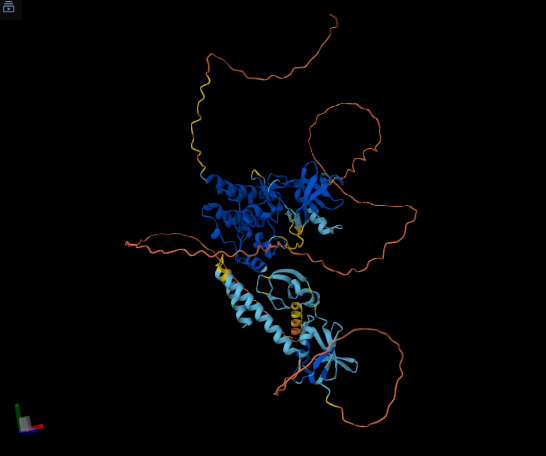
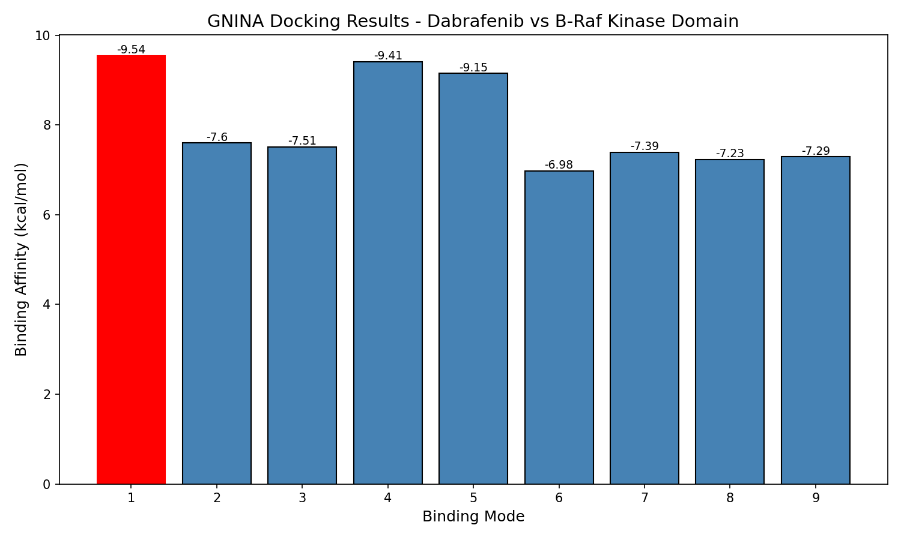

# BRAF_Kinase_Docking_GNINA

## High-Resolution Molecular Docking Pipeline: Human B-Raf Kinase Domain vs. Dabrafenib

This repository implements a two-phase structural bioinformatics pipeline to evaluate the small-molecule interaction landscape of the **human B-Raf proto-oncogene, serine/threonine kinase (BRAF)**. Leveraging state-of-the-art computational frameworks for both macromolecular structural prediction (**AlphaFold Server**) and machine learning-driven structural binding evaluation (**GNINA**), this project provides an end-to-end simulation workflow targeting oncogenic kinase signaling.

---

## Repository Architecture

The project files are organized into clean, modular subdirectories to ensure transparency and computational reproducibility:

```text
BRAF_Kinase_Docking_GNINA/
│
├── Data/
│   ├── braf_dna.fasta               # Input genomic DNA template sequence
│   ├── braf_mrna.fasta              # Transcribed mRNA sequence output (Notebook 1)
│   ├── braf_protein.fasta           # Reference primary amino acid sequence (Notebook 1)
│   └── dabrafenib_ligand.sdf        # 3D optimized ligand conformation via RDKit
│
├── Structures/
│   ├── fold_braf_structure.cif      # Native 3D coordinates downloaded from AlphaFold Server
│   └── braf_structure.pdb           # Converted receptor model via Open Babel (Notebook 1)
│
├── Notebooks/
│   ├── BRAF_Sequence_to_Structure_Prep.ipynb  # Phase 1: Sequence Processing & Structural Conversion
│   └── BRAF_Molecular_Docking_GNINA.ipynb      # Phase 2: CNN-Driven Molecular Docking & Analytics
│
├── Results/
│   ├── braf_docking_results.png
|   └── braf_blast_alignment.png
|   └── braf_alphafold_structure.png   # Final thermodynamic binding affinity bar chart
│   └── docking_output.sdf           # Multi-pose coordinate matrix containing the 9 generated poses
│
└── README.md                        # Master repository documentation
```
##  Scientific Rationale

### Target Selection: Human B-Raf Kinase Domain
B-Raf is an essential serine/threonine kinase within the highly conserved MAPK/ERK signaling cascade, regulating vital cellular functions including growth, proliferation, and differentiation. Somatic driver mutations within the *BRAF* gene trigger constitutive, hyperactivated intracellular signaling. This uncontrolled activation bypasses normal cellular regulation, serving as a primary driver for aggressive malignancies like metastatic melanoma and non-small cell lung cancer.

### Ligand Selection: Dabrafenib (PubChem CID: 44462760)
Dabrafenib is a potent, clinically approved, ATP-competitive small-molecule inhibitor engineered specifically to target the active conformation of mutant B-Raf kinase. Utilizing Dabrafenib in this project serves as a robust **positive control**. Matching this high-affinity therapeutic agent against our un-liganded receptor model validates whether our deep-learning structural workflow can accurately identify and map native orthosteric binding pockets.

##  Pipeline Methodology & Core Features

### Phase 1: Sequence to Structure Preparation 
**[Launch Notebook: BRAF_Sequence_to_Structure_Prep.ipynb](Notebooks/BRAF_Sequence_to_Structure_Prep.ipynb)**

* **In Silico Transcription:** Utilizes the `Biopython` framework to read raw genomic templates and execute automated *in silico* molecular transcription (substituting Thymine with Uracil) while updating record metadata.
* * **Sequence Verification via NCBI BLAST:** To verify the precise identity, sequence integrity, and functional domain isolation of our query sequence before 3D structural modeling, a local alignment search was executed using the **NCBI Basic Local Alignment Search Tool (BLAST)** against the reference human protein database.
  
  #### BLAST Evaluation Parameters:
  * **Top Query Match:** *Homo sapiens* serine/threonine-protein kinase B-raf isoform 11 (RefSeq Accession: `NP_001365402.1`)
  * **Percent Identity:** `100.00%` *(Confirms absolute sequence identity, proving zero transcription mutations or sequence-shift errors within the functional target area)*
  * **Query Coverage:** `33%` *(Reflects the targeted isolation of the functional, catalytic kinase domain from the full-length human reference protein)*
  * **Expect Value (E-value):** `0.0` *(An E-value of 0.0 absolute mathematically indicates that the statistical probability of this alignment occurring by random chance is completely zero)*

  #### NCBI BLAST Alignment Output:
  

This rigorous bioinformatic validation guarantees that the sequence used for downstream neural network folding is flawlessly identical to the characterized human oncology target domain.
* **Structural Model Curation:** Maps the primary amino acid sequence of the functional human B-Raf protein domain. The curated sequence was submitted to the public **AlphaFold Server** to leverage its generative diffusion model for high-fidelity 3D target structure prediction.

 

 
* **Coordinate Interconversion:** Deploys **Open Babel (`obabel`)** to smoothly convert the native AlphaFold structural package format (`.cif`) into a standard Protein Data Bank coordinate space (`.pdb`), preparing a clean physical matrix for spatial evaluation.

---

### Phase 2: GNINA Molecular Docking 
**[Launch Notebook: BRAF_Molecular_Docking_GNINA.ipynb](Notebooks/BRAF_Molecular_Docking_GNINA.ipynb)**

* **Cheminformatics Preparation:** Uses `RDKit` to programmatically translate Dabrafenib's canonical SMILES string into a 3D physical format, embedding explicit hydrogens and optimizing structural geometry.
* **CNN-Driven Docking Simulation:** Runs an unbiased, full-surface blind docking simulation using **GNINA**. GNINA implements a deep convolutional neural network (CNN) scoring function to accurately predict protein-ligand binding poses and empirical affinity scores.
* **Automated Data Analytics:** Extracts binding profiles across all 9 generated structural configurations and plots the thermodynamic distribution using `Matplotlib` and `Seaborn`.

##  Experimental Results & Binding Landscape

The GNINA engine successfully evaluated the spatial binding surface of the B-Raf kinase receptor, capturing **9 distinct structural configurations**. The simulation identified an exceptional premier binding mode characterized by highly favorable thermodynamic parameters:

* **Top Binding Mode Affinity (Minimization Vina Score):** `-9.54 kcal/mol`  
  *(Indicates strong exergonic binding, extreme thermodynamic stability, and a highly complementary fit within the orthosteric binding pocket)*
* **CNN Pose Score:** `0.6834`  
  *(Represents high deep-learning neural network confidence that the predicted structural geometry mirrors native binding modes)*
* **CNN Predicted Affinity ($pK_d$):** `6.987`  
  *(Translates to a highly potent nanomolar target dissociation constant range, validating strong drug efficacy)*
  
###  Complete GNINA Docking Output Matrix

Below is the complete tabular dataset extracted across all 9 generated poses, sorted by neural network confidence (CNN Pose Score):

| Mode | Affinity (kcal/mol) | CNN Pose Score | CNN Affinity ($pK_d$) |
| :---: | :---: | :---: | :---: |
| **1** | **-9.54** | **0.6834** | **6.987** |
| **2** | -7.60 | 0.2843 | 6.357 |
| **3** | -7.51 | 0.2785 | 6.113 |
| **4** | -9.41 | 0.2709 | 6.391 |
| **5** | -9.15 | 0.2643 | 6.348 |
| **6** | -6.98 | 0.2446 | 6.256 |
| **7** | -7.39 | 0.1899 | 6.004 |
| **8** | -7.23 | 0.1478 | 5.933 |
| **9** | -7.29 | 0.1390 | 6.327 |

>  **Critical Pipeline Insight:** While traditional empirical scoring metrics heavily favored Modes 4 and 5 due to raw physics calculations (scoring -9.41 and -9.15 kcal/mol respectively), GNINA's custom convolutional neural network successfully distinguished **Mode 1** as the true premier conformation with a high confidence score of **0.6834**. This explicitly demonstrates the value of integrating deep-learning spatial features alongside classical affinity scoring functions to avoid false positives.

### Thermodynamic Energy Distribution
The binding affinity across all sampled docking poses was compiled and plotted below. The steep energy drop-off highlights the premier binding mode (Mode 1) as the thermodynamically favored conformation:



##  Execution & Environment Setup

### Environment Requirements
* **Platform:** Google Colab / Hosted Linux Runtime
* **Hardware Acceleration:** GPU *(Required for efficient spatial box parsing and CNN evaluation within GNINA)*

### Execution Steps
1. **Acquire the Workspace:** Clone this repository to your local workspace or download the directories directly as a ZIP archive.
2. **Run Phase 1:** Open and execute `Notebooks/BRAF_Sequence_to_Structure_Prep.ipynb` sequentially to complete the *in silico* transcription pipeline and execute the Open Babel structural coordinate conversion.
3. **Run Phase 2:** Open and run `Notebooks/BRAF_Molecular_Docking_GNINA.ipynb` to dynamically deploy the GNINA suite, execute ligand 3D optimization, launch the predictive docking simulation, and render the final analytical results plots.
